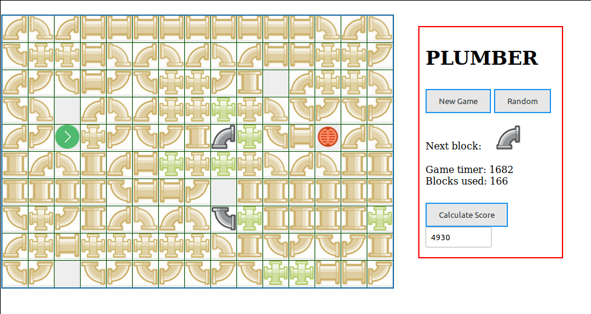

# PlumberGame
Browser-based pipe game

The goal of the game is to complete a pipe from the start to the drain.
Pipe pieces are randomly made.
The plumber (ie, you) must place each pipe piece on the gameboard so that there will be no breaks in the flow.

# Starting board

Place pipe pieces anywhere on the board to build a single pipe from the green start arrow to the red drain.
When you have completed a pipe, click on the "Calculate Score" button to check your plumbing.

# Completed
